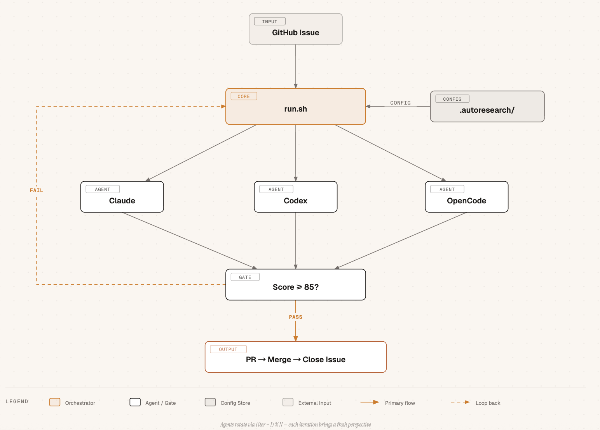
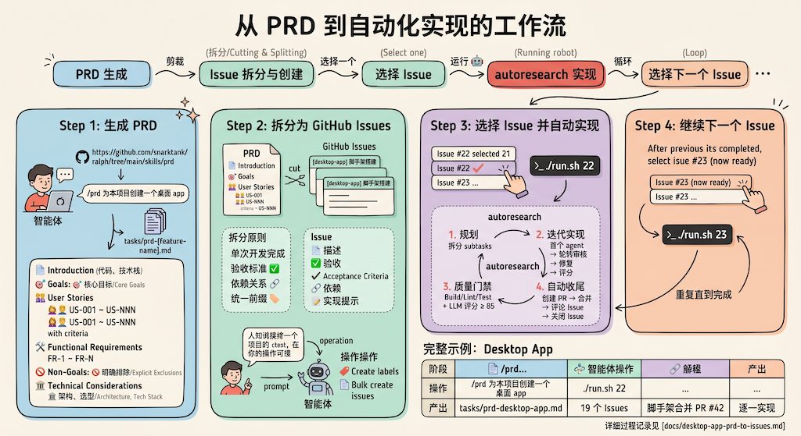

# Autoresearch for Software Development

> 全自动化软件开发工具，你只需负责喝茶和睡觉。
> 一觉醒来，Features 全自动高质量的实现了。


基于 [karpathy/autoresearch](https://github.com/karpathy/autoresearch) 思想实现的通用的基于 GitHub Issue 管理的全自动化开发工具。支持任意 Git + GitHub 项目（Go、Node.js、Python、Rust、Java 等）。

使用 autoresearch 实现本项目 Issue#2：
[](https://asciinema.org/a/KdHGFHK6pcelUdPg)

---

## 目录

- [快速开始](#快速开始)
- [前置条件](#前置条件)
- [项目架构](#项目架构)
- [工作流程](#工作流程)
- [工具配置](#工具配置)
- [与 ralph 对比](#与-ralph-对比)

---

## 快速开始

```bash
# 下载项目
git clone https://github.com/PacemakerG/autoresearch-swe-agent.git
cd autoresearch-swe-agent

# 创建隔离环境并安装本项目
uv sync

# 处理当前目录项目的 Issue#10
./run.sh 10

# 自动选择下一个可执行 Issue
./run.sh --next

# 顺序处理 3 个可自动执行的 Issue
./run.sh --batch 3

# 以 daemon 模式持续轮询，每 60 秒处理最多 2 个 Issue
./run.sh --daemon --batch 2 --poll-interval 60

# 查看本地运行指标汇总
./run.sh --report

# 从 PRD markdown 生成 issue 草案 JSON
./run.sh --plan-prd tasks/prd-desktop-app.md --issue-output issue-drafts.json

# 或直接使用 Python 入口
uv run python -m autoresearch.cli 10

# 处理指定目录项目的 Issue#10
autoresearch/run.sh -p /path/to/project 10

# 指定最大迭代次数为 16 次
autoresearch/run.sh -p /path/to/project 10 16

# 调整达标线为 90 分
PASSING_SCORE=90 autoresearch/run.sh 10

# 指定启用的 agents 及顺序（首个 agent 做初始实现）
autoresearch/run.sh -a claude,codex 10

# 继续处理 Issue#42，追加 10 次迭代
autoresearch/run.sh -c 42 10
```

## 前置条件

需要安装以下工具（按需安装）：

```bash
gh auth status          # GitHub CLI
gh auth login           # 首次使用需要登录
which claude            # Claude Code CLI
which codex             # OpenAI Codex CLI
which opencode          # OpenCode CLI
```

项目需有对应语言的构建工具（Go/Node/Python/Rust/Java）。

---

## 项目架构



核心流程：

| 组件 | 说明 |
|------|------|
| **GitHub Issue** | 触发输入 |
| **autoresearch/** | Python 核心运行器 |
| **run.sh** | 兼容入口包装层 |
| **Claude / Codex / OpenCode** | 三个 Agent 轮转审核 |
| **Issue Scheduler** | 自动选择下一个可执行 Issue |
| **Score ≥ 85?** | 评分门控 |
| **PASS** | 自动创建 PR → 合并 → 关闭 Issue |
| **FAIL** | 进入下一轮迭代修复 |

Agent 轮转公式：`(iter − 1) % N`

---

## 工作流程

### 单 Issue 流程

```
Issue → 首个 Agent 实现 → 轮转审核+修复 → 自动 PR → 合并 → 关闭 Issue
```

- **迭代 1**: `-a` 列表中的第一个 agent 初始实现
- **迭代 2+**: 所有启用的 agents 按顺序轮流审核并修复
- 评分达标（默认 ≥ 85）后自动创建 PR、合并、评论并关闭 Issue

### 推荐工作流：从 PRD 到自动实现

完整端到端工作流：**PRD 生成 → Issue 拆分 → autoresearch 实现**

```
PRD 生成 → Issue 拆分与创建 → 选择 Issue → autoresearch 实现 → 选择下一个 Issue → ...
```



#### Step 1: 生成 PRD

使用 `/prd` skill 生成交付需求文档：

```
/prd 为本项目创建一个桌面 app
```

#### Step 2: 拆分为 GitHub Issues

让智能体基于 PRD 拆分 Issue：

```text
基于 PRD 中的 User Stories 拆分为细粒度 Issue，并在 GitHub 上创建这些 issue。

拆分原则：
- 每个 Issue 可在单次开发会话中完成
- 有明确的验收标准（checkbox）
- 标注依赖关系
```

#### Step 3: 选择 Issue 并自动实现

```bash
./run.sh 22
```

autoresearch 会：
1. 规划阶段：拆分 subtasks（如需要）
2. 迭代实现：首个 agent 实现 → 轮转审核 → 修复 → 评分
3. 质量门禁：Build/Lint/Test + 结构化审核结果
4. 自动收尾：创建 PR → 合并 → 评论 Issue → 关闭 Issue

#### 完整示例

以本项目 Desktop App 为例：19 个 Issues (#22 ~ #40) 从 PRD 到全部实现。

详细过程见 [docs/desktop-app-prd-to-issues.md](docs/desktop-app-prd-to-issues.md)。

---

## 工具配置

### 项目自定义配置

在项目目录下创建 `.autoresearch/`：

```
.autoresearch/
├── agents/
│   ├── codex.md          # 自定义 Codex 指令
│   ├── claude.md         # 自定义 Claude 指令
│   └── opencode.md       # 自定义 OpenCode 指令
├── program.md            # 自定义实现规则与约束
├── metrics.jsonl         # 运行指标（自动生成）
├── workflows/            # 各 Issue 详细记录（自动生成）
└── results.tsv           # 处理结果日志（自动生成）
```

### 命令行参数

| 参数 | 默认值 | 说明 |
|------|--------|------|
| `-p <path>` | 当前目录 | 项目路径 |
| `-a <agents>` | `claude,codex,opencode` | 指定启用 agents 及顺序 |
| `-c` | 关闭 | 继续模式，从上次中断的迭代继续 |
| `--no-archive` | 关闭 | 跳过旧 workflow 归档 |
| `--next` | 关闭 | 自动选择下一个可执行 Issue |
| `--batch <N>` | 关闭 | 顺序处理前 N 个可执行 Issue |
| `--repo <owner/repo>` | 当前 origin | 指定 GitHub 仓库 |
| `--report` | 关闭 | 输出本地 metrics 汇总报告 |
| `--daemon` | 关闭 | 持续轮询并处理 issue 队列 |
| `--poll-interval <sec>` | `60` | daemon 轮询间隔 |
| `--lease-ttl <sec>` | `1800` | worker lease 过期时间 |
| `--worker-id <id>` | 自动生成 | 指定 worker 标识 |
| `--plan-prd <path>` | 关闭 | 从 PRD markdown 生成 issue 草案 |
| `--issue-output <path>` | stdout | 将 issue 草案输出为 JSON |
| `--create-issues` | 关闭 | 配合 `--plan-prd` 直接在 GitHub 创建 issues |
| `--issue-label <label>` | 空 | 创建 issue 时附加 label，可重复传入 |
| `PASSING_SCORE` | 85 | 达标评分线（百分制） |
| `MAX_CONSECUTIVE_FAILURES` | 3 | 连续失败停止阈值 |
| `MAX_RETRIES` | 5 | 单次 agent 调用重试次数 |
| `AUTO_MERGE_MODE` | `safe` | 自动合并策略：`safe` / `always` / `never` |
| `METRICS_ENABLED` | `true` | 是否记录 `.autoresearch/metrics.jsonl` |

### 裁剪 program.md

`program.md` 包含多种语言的规范模板。使用前应根据目标项目语言裁剪，只保留相关规范以减少 token 消耗。

**示例**：Go 后端项目只需保留「通用规范」和「Go 代码规范」章节，删除 Python/TypeScript/Rust/前端等无关章节。

### 文件说明

| 文件 | 用途 |
|------|------|
| `run.sh` | 兼容入口，转发到 Python CLI |
| `autoresearch/cli.py` | 命令行入口 |
| `autoresearch/runner.py` | 主流程编排 |
| `autoresearch/logic.py` | agent 轮转、评分提取、错误检测等纯逻辑 |
| `autoresearch/github.py` | GitHub CLI 访问封装 |
| `autoresearch/tasks.py` | 子任务状态管理 |
| `autoresearch/progress.py` | 跨迭代经验日志管理 |
| `autoresearch/gates.py` | Build / Lint / Test 硬门禁 |
| `autoresearch/review_schema.py` | 结构化 reviewer 输出解析 |
| `autoresearch/scheduler.py` | Issue 选择与优先级调度 |
| `autoresearch/policy.py` | 自动 merge 策略与人工审批判断 |
| `autoresearch/finalizer.py` | PR 创建、merge、Issue 收尾 |
| `autoresearch/telemetry.py` | 运行指标记录 |
| `autoresearch/reporting.py` | metrics 汇总报告 |
| `autoresearch/lease.py` | worker lease 管理 |
| `autoresearch/queue_runner.py` | 队列执行器 |
| `autoresearch/daemon.py` | 持续轮询模式 |
| `autoresearch/spec_parser.py` | PRD markdown 解析 |
| `autoresearch/issue_generator.py` | 从 User Stories 生成 issue 草案 |
| `autoresearch/ui.py` | UI 验证、截图与 dev server 管理 |
| `program.md` | 默认实现规则与约束 |
| `agents/*.md` | Agent 提示词模板 |
| `tests/test_*.py` | Python 单元测试 |

### 自动合并策略

默认 `AUTO_MERGE_MODE=safe`：

- 简单或中等复杂度 Issue：允许自动 merge
- 高风险标签（如 `security`、`auth`、`migration`、`production`）：创建 PR 后等待人工审批
- 复杂任务：创建 PR 后等待人工审批

可选模式：

- `AUTO_MERGE_MODE=always`：总是自动 merge
- `AUTO_MERGE_MODE=never`：始终只创建 PR，不自动 merge

### Daemon 与 Lease

- `--daemon` 会持续轮询 issue 队列
- `--lease-ttl` 用于控制 Issue 租约过期时间
- 多个 worker 并行运行时，同一 Issue 只会被一个 worker 获取租约并执行

---

## 与 ralph 对比

[ralph](https://github.com/snarktank/ralph) 是类似的自动化开发工具。

### 核心差异

| 维度 | **autoresearch** | **ralph** |
|------|-----------------|-----------|
| **驱动方式** | GitHub Issue | PRD（`prd.json`） |
| **Agent 模型** | 多 Agent 轮转交叉审核 | 单 Agent 反复迭代 |
| **质量门禁** | 硬门禁（Build/Lint/Test）+ 软门禁（LLM 评分） | 纯工具链检查 |
| **审核机制** | 不同 Agent 交叉审核 | 无独立审核 |
| **端到端** | Issue → PR → 合并 → 关闭（全自动闭环） | 止步于代码完成 |
| **Continue 模式** | 支持 `-c` 恢复 | 无 |
| **UI 验证** | 浏览器截图 + LLM 视觉验证 | `dev-browser` skill |

### 各自优势

**autoresearch 优势：**
- 双轨质量门禁覆盖更广
- 多 Agent 交叉审核提供不同视角
- GitHub 端到端自动化闭环
- 上下文溢出自动交接
- Continue 模式支持中断恢复

**ralph 优势：**
- PRD 驱动，语义更丰富
- 四通道记忆形成完整知识体系
- 确定性质量门禁更稳定
- Skills 插件系统可扩展
- 内置流程序可视化

---

## 类似项目

- [snarktank/ralph](https://github.com/snarktank/ralph)
- [karpathy/autoresearch](https://github.com/karpathy/autoresearch)（原版思想）
- [达尔文.skill](https://github.com/alchaincyf/darwin-skill): 使用 autoresearch 优化Skill, 花叔出品
